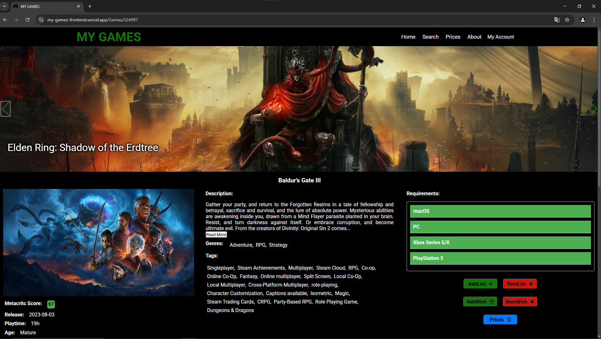

# MY Games

**MY Games** é uma aplicação web para que os usuários possam gerenciar suas listas de jogos. Com esse site, você pode organizar tanto os jogos que você já possui quanto os jogos que deseja adquirir (wish list). Além disso, o sistema permite visualizar os preços dos jogos em diferentes lojas e fornece informações detalhadas, como descrições, screenshots e outros dados relevantes dos jogos.

## Funcionalidades

- **Gerenciamento de Listas de Jogos:** Adicione jogos à sua lista de posses e à wish list.
- **Preços em Diferentes Lojas:** Consulte os preços atualizados dos jogos em várias lojas online.
- **Informações Detalhadas:** Acesse descrições, imagens e outras informações sobre cada jogo.
- **Interface Intuitiva:** Navegação simples para adicionar e visualizar jogos, com filtro por preço e plataforma.

## Links Importantes

- O site completo pode ser acessado [aqui](https://my-games-frontend.vercel.app/).
- O repositório do backendd pode ser conferido [aqui](https://github.com/Igor-Wolf/MyGamesBackend).

## Tecnologias Utilizadas

- **Frontend:** [Next.js](https://nextjs.org/) — Framework React para construção de interfaces dinâmicas e eficientes.
- **Backend:** [Node.js](https://nodejs.org/en/) — Ambiente de execução para JavaScript no servidor.
- **Outras Tecnologias e Bibliotecas:**
  - React
  - Axios (para chamadas API)
  - Styled-components (para estilização)

## Observações adicionais

- Para utilização do site é necessário a realização do cadastro e autenticação por email.
- Para um teste rápido é possivel utilizar o user:Teste e pass:1234, mas esse login pode sofrer alterações.
- Qualquer dúvida entre em contato

